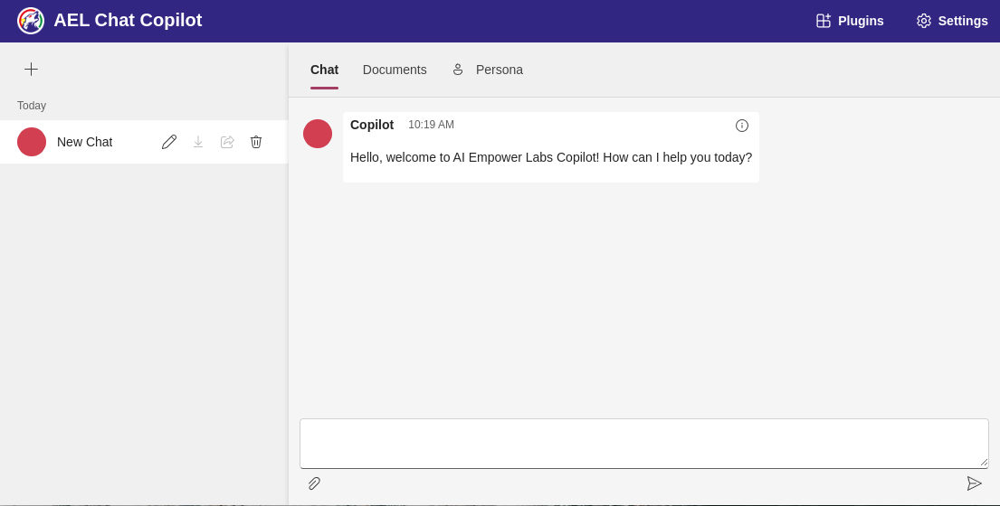

# Copilot Installation Guide

This guide provides instructions for running Copilot in Docker on Linux or macOS.

## Requirements

To set up and run Copilot, the following tools are required:

- [Git](https://git-scm.com/)
- [Docker and docker compose](https://www.docker.com/)
- [nano text editor](https://www.nano-editor.org/)

## Installation Steps

* Clone the repository:
   ```sh
   git clone https://github.com/AI-Empower-Labs/Studio
   ```
* Navigate to the Copilot docker directory (ensure you are in the correct repository folder):
   ```sh
   cd ./Studio/Copilot/docker
   ```
* Copy the `.env` example file and modify it as needed:
   ```sh
   cp .env.example .env
   ```
* Copy the `env.example` file for the web API and modify it as needed:
   ```sh
   cp ./webapi/.env.example ./webapi/.env
   ```
* Edit the `env.example` file for the web API and modify it as needed. For example
   ```sh
   nano ./webapi/.env
   ```
   For example modify the Studio server endpoint by adding this line and changind the url to a predefined known endpoint:
   ```
   AIEmpowerLabs__Url=https://<url>
   ```

* Build the Docker containers(Ensure Docker is running before building the containers):
   ```sh
   docker compose build
   ```
* Start the containers:
   ```sh
   docker compose up
   ```
* In another terminal run to check all containers are running:
   ```sh
   docker compose ps
   ```
   Should look something like
   ```sh
   NAME                           IMAGE                                          COMMAND      SERVICE               CREATED          STATUS          PORTS
   docker-chat-copilot-webapi-1   docker.io/library/chat-copilot-webapi:latest   ""           chat-copilot-webapi   14 seconds ago   Up 13 seconds   8080/tcp
   docker-chat-copilot-webapp-1   docker.io/library/chat-copilot-webapp:latest   ""           chat-copilot-webapp   13 seconds ago   Up 12 seconds   3000/tcp
   docker-postgres-1              docker.io/ankane/pgvector:latest               "postgres"   postgres              13 seconds ago   Up 13 seconds
   ```


Now, your Copilot should be up and running!
Allow for some time to get the applications started up depending of the speed opf your system, then navigate to http://localhost:3000 .




## Troubleshooting

If you encounter issues, here are some common troubleshooting steps:

- **Connectivity Problems**: Ensure all required ports are open and that Docker has internet access.
- **Missing Environment Variables**: Double-check that all required environment variables are properly set in the `.env` files.
- **Container Failing to Start**: Review the logs using `docker compose logs` to identify any issues during startup.


