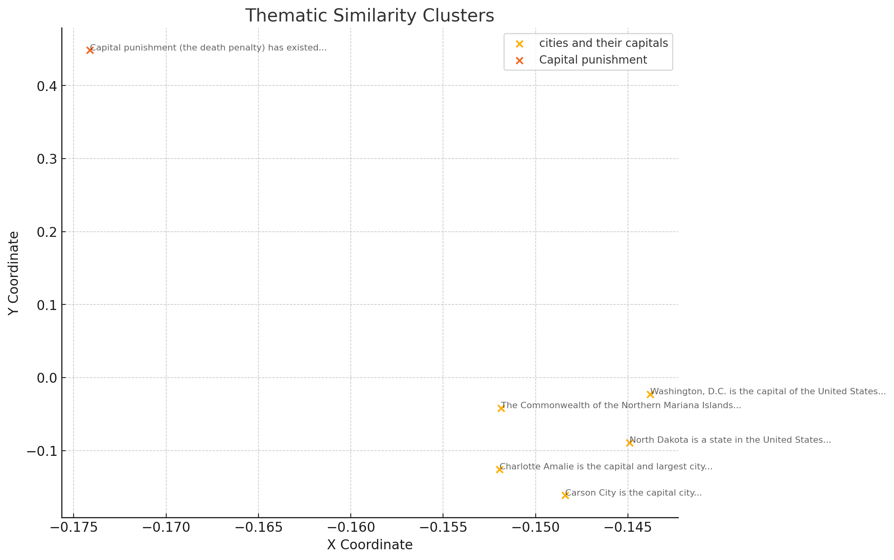

# Thematic Similarity Clustering API

## Overview
This repository provides an API endpoint for generating thematic similarity clusters from a list of input texts using the K-Means clustering algorithm. The API allows users to specify the number of clusters they wish to generate and optionally configure additional parameters such as the maximum degree of parallelism and models used for generating embeddings.

## K-Means Clustering
K-Means is a popular clustering algorithm used in data analysis to group similar data points into clusters. The algorithm works by iteratively assigning each data point to one of the predefined number of clusters based on their distance to the cluster centroids, which represent the center of each cluster. The centroid positions are updated until the algorithm converges, resulting in clusters where data points within the same cluster are more similar to each other than to those in different clusters.

This API leverages the K-Means algorithm to create thematic similarity clusters from input text data. Each cluster represents a group of texts that share similar themes or topics, making it a powerful tool for text analysis, summarization, and topic modeling.

## Endpoint

### POST `/api/extract/thematic-similarity-cluster`

#### Description

This endpoint accepts a list of text inputs and returns clusters of thematically similar texts. The clustering is performed using the K-Means algorithm, where the user can specify the desired number of clusters. Additional parameters allow for customization of the clustering process.

#### Request Body

The request body must be in JSON format and contain the following fields:

- **`input`**: An array of strings, where each string represents a piece of text to be clustered.
- **`clusterCount`**: An integer specifying the number of clusters to generate. The value must be between 2 and 1000.
- **`maxDegreeOfParallelism`** (optional): An integer specifying the maximum degree of parallelism for the K-Means clustering algorithm. The default is 1, and it must be between 1 and 100.
- **`maxTokens`** (optional): An integer specifying the maximum number of tokens per text for the clustering process. The default is 10, and it must be between 1 and 100.
- **`llmModel`** (optional): A string specifying the name of the Language Model (LLM) to use. This field is optional and can be omitted.
- **`embeddingModel`** (optional): A string specifying the name of the embedding model used for clustering. This field is optional and can be omitted.

#### Example Request

```json
POST http://localhost:8080/api/extract/thematic-similarity-cluster
Content-Type: application/json

{
    "input": [
        "Carson City is the capital city of the American state of Nevada. At the 2010 United States Census, Carson City had a population of 55,274.",
        "The Commonwealth of the Northern Mariana Islands is a group of islands in the Pacific Ocean that are a political division controlled by the United States. Its capital is Saipan.",
        "Charlotte Amalie is the capital and largest city of the United States Virgin Islands. It has about 20,000 people. The city is on the island of Saint Thomas.",
        "Washington, D.C. (also known as simply Washington or D.C., and officially as the District of Columbia) is the capital of the United States. It is a federal district.",
        "Capital punishment (the death penalty) has existed in the United States since before the United States was a country. As of 2017, capital punishment is legal in 30 of the 50 states.",
        "North Dakota is a state in the United States. 672,591 people lived in North Dakota in the year 2010. The capital and seat of government is Bismarck."
    ],
    "clusterCount": 2
}
```

#### Responses

- **200 OK**: The request was successful, and the response contains the generated clusters.
  - **Content-Type: application/json**
  - **Content-Type: text/csv** (if the request header `Accept: text/csv` is set)

##### Example JSON Response

```json
{
  "clusterSize": 2,
  "centroids": [
    {
      "clusterId": 2,
      "coordinate": {
        "x": -0.17432278,
        "y": -0.44455597,
        "label": "Capital punishment"
      },
      "dataPoints": [
        {
          "x": -0.17432278,
          "y": -0.44455597,
          "label": "Capital punishment (the death penalty) has existed in the United States since before the United States was a country. As of 2017, capital punishment is legal in 30 of the 50 states."
        }
      ]
    },
    {
      "clusterId": 1,
      "coordinate": {
        "x": -0.1481507,
        "y": 0.0875022,
        "label": "cities and their capitals"
      },
      "dataPoints": [
        {
          "x": -0.14836788,
          "y": 0.15626708,
          "label": "Carson City is the capital city of the American state of Nevada. At the  2010 United States Census, Carson City had a population of 55,274."
        },
        {
          "x": -0.1521331,
          "y": 0.064661846,
          "label": "The Commonwealth of the Northern Mariana Islands is a group of islands in the Pacific Ocean that are a political division controlled by the United States. Its capital is Saipan."
        },
        {
          "x": -0.15199769,
          "y": 0.15700048,
          "label": "Charlotte Amalie is the capital and largest city of the United States Virgin Islands. It has about 20,000 people. The city is on the island of Saint Thomas."
        },
        {
          "x": -0.14341223,
          "y": 0.0017501377,
          "label": "Washington, D.C. (also known as simply Washington or D.C., and officially as the District of Columbia) is the capital of the United States. It is a federal district. "
        },
        {
          "x": -0.14484257,
          "y": 0.05783147,
          "label": "North Dakota is a state in the United States. 672,591 people lived in North Dakota in the year 2010. The capital and seat of government is Bismarck."
        }
      ]
    }
  ]
}
```

##### Example CSV Response

If the `Accept` header is set to `text/csv`, the response will be in CSV format:

```csv
clusterId,clusterLabel,x,y,label
2,Capital punishment,-0.17478639,-0.43926504,"Capital punishment (the death penalty) has existed in the United States since before the United States was a country. As of 2017, capital punishment is legal in 30 of the 50 states."
1,cities and their capitals,-0.14798689,0.17053927,"Carson City is the capital city of the American state of Nevada. At the  2010 United States Census, Carson City had a population of 55,274."
1,cities and their capitals,-0.1521753,0.07095035,The Commonwealth of the Northern Mariana Islands is a group of islands in the Pacific Ocean that are a political division controlled by the United States. Its capital is Saipan.
1,cities and their capitals,-0.1518811,0.14289644,"Charlotte Amalie is the capital and largest city of the United States Virgin Islands. It has about 20,000 people. The city is on the island of Saint Thomas."
1,cities and their capitals,-0.14337993,-0.02449449,"Washington, D.C. (also known as simply Washington or D.C., and officially as the District of Columbia) is the capital of the United States. It is a federal district. "
1,cities and their capitals,-0.14487398,0.07341845,"North Dakota is a state in the United States. 672,591 people lived in North Dakota in the year 2010. The capital and seat of government is Bismarck."
```

- **400 Bad Request**: The request was malformed or contains invalid parameters.
- **429 Too Many Requests**: The server is receiving too many requests in a given time frame.
- **500 Internal Server Error**: An unexpected error occurred on the server.

## Usage

To use this API, you need to make a POST request to the `/api/extract/thematic-similarity-cluster` endpoint with a JSON payload containing the required `input` and `clusterCount` fields. The response will contain the generated clusters in JSON or CSV format based on your request headers.

### Prerequisites

- Ensure the API server is running on `http://localhost:8080`.
- Use an API client like Postman, Curl, or any HTTP library in your preferred programming language.

### Example Curl Command

```bash
curl -X POST http://localhost:8080/api/extract/thematic-similarity-cluster \
    -H "Content-Type: application/json" \
    -d '{
        "input": [
            "Carson City is the capital city of the American state of Nevada...",
            "The Commonwealth of the Northern Mariana Islands is a group of islands...",
            ...
        ],
        "clusterCount": 2
    }'
```

### Example Python Request

```python
import requests

url = "http://localhost:8080/api/extract/thematic-similarity-cluster"
headers = {"Content-Type": "application/json"}
data = {
    "input": [
        "Carson City is the capital city of the American state of Nevada...",
        "The Commonwealth of the Northern Mariana Islands is a group of islands...",
        ...
    ],
    "clusterCount": 2
}

response = requests.post(url, json=data, headers=headers)
print(response.json())
```

## Visualizing results

```python
import matplotlib.pyplot as plt

# Example response data
response = {
    "clusterSize": 2,
    "centroids": [
        {
            "clusterId": 1,
            "coordinate": {
                "x": -0.14818683,
                "y": -0.08817512,
                "label": "cities and their capitals"
            },
            "dataPoints": [
                {"x": -0.1484083, "y": -0.16131228, "label": "Carson City is the capital city..."},
                {"x": -0.15187132, "y": -0.04186835, "label": "The Commonwealth of the Northern Mariana Islands..."},
                {"x": -0.1519506, "y": -0.12574847, "label": "Charlotte Amalie is the capital and largest city..."},
                {"x": -0.14379919, "y": -0.022728091, "label": "Washington, D.C. is the capital of the United States..."},
                {"x": -0.14490473, "y": -0.08921837, "label": "North Dakota is a state in the United States..."}
            ]
        },
        {
            "clusterId": 2,
            "coordinate": {
                "x": -0.17413735,
                "y": 0.44853252,
                "label": "Capital punishment"
            },
            "dataPoints": [
                {"x": -0.17413735, "y": 0.44853252, "label": "Capital punishment (the death penalty) has existed..."}
            ]
        }
    ]
}

# Plotting
for centroid in response['centroids']:
    x = [point['x'] for point in centroid['dataPoints']]
    y = [point['y'] for point in centroid['dataPoints']]
    labels = [point['label'] for point in centroid['dataPoints']]
    
    plt.scatter(x, y, label=centroid['coordinate']['label'])
    
    for i, label in enumerate(labels):
        plt.annotate(label, (x[i], y[i]), fontsize=8, alpha=0.75)

plt.xlabel('X Coordinate')
plt.ylabel('Y Coordinate')
plt.title('Thematic Similarity Clusters')
plt.legend()
plt.show()
```

produces 



## Conclusion
This API provides a straightforward way to generate thematic similarity clusters from a set of text inputs using the K-Means clustering algorithm. It can be used for a wide range of text analysis tasks, including topic modeling, document clustering, and summarization. By adjusting the parameters, users can fine-tune the clustering process to suit their specific needs.